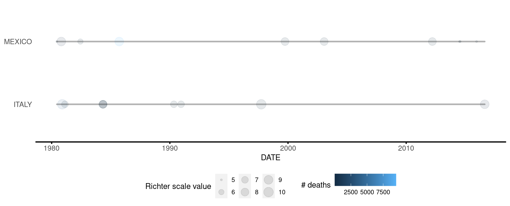
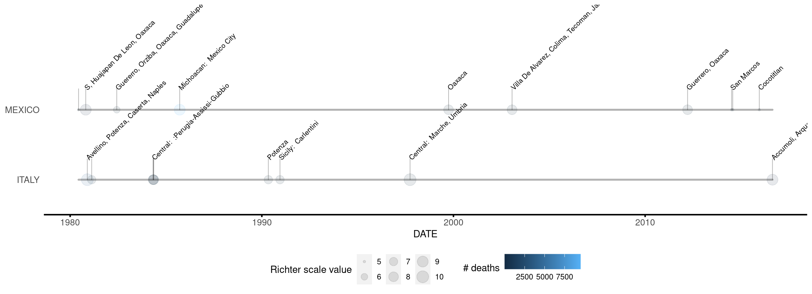
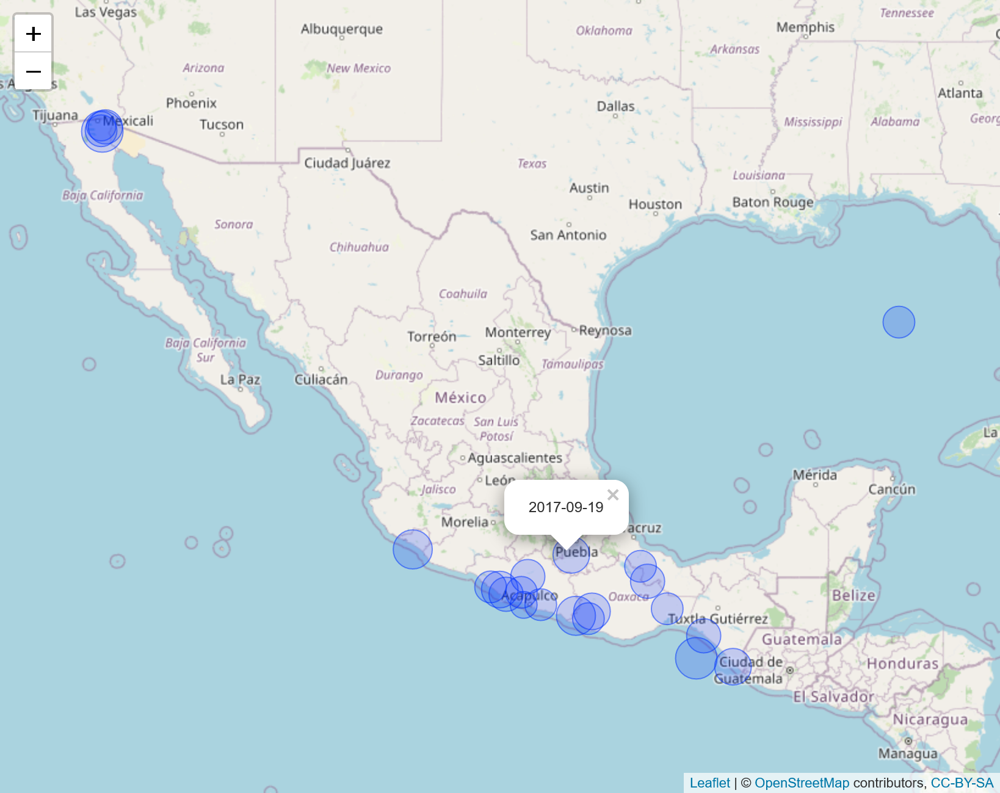
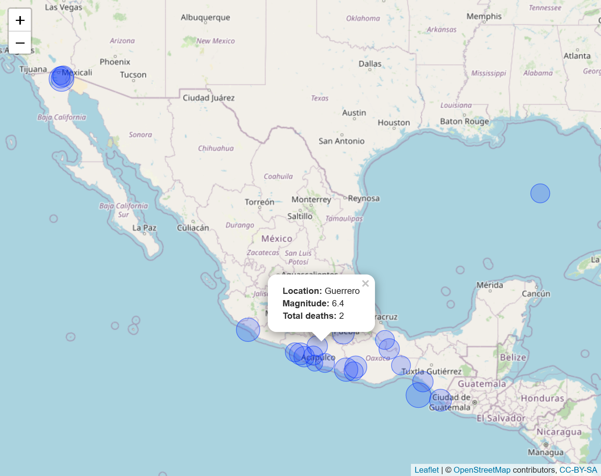

# course5assignment1

<!-- badges: start -->
[](https://github.com/proton-2022/course5assignment1/actions/workflows/R-CMD-check.yaml)
<!-- badges: end -->

## Note to peer-reviewer

GitHub Action, instead of Travis CI, was used to build and test the package, due to credit requirement for the latter. YAML file can be found in [.github/workflows/R-CMD-check.yaml](https://github.com/proton-2022/course5assignment1/blob/main/.github/workflows/R-CMD-check.yaml).  

## Description 

The goal of course5assignment1 is to to clean up earthquake data 
from NOAA, to visualize a subset of the data on a timeline, and to visualize data 
in a map with annotations. 

## Installation

``` r
# The development version of this package can be installed from github
# install.package("devtools")
devtools::install_github("proton-2022/course5assignment1")
```

## Usage 

The following are basic examples for how to use functions in this package: 

### Clean up data 

Prepare NOAA data for visualization. 

``` r
library(course5assignment1)

# use `eq_clean_data` to obtain a data.frame that can be used for visualization.
data_raw <- readr::read_delim("./signif.txt") 
data_cleaned <- eq_clean_data(data_raw) 
```

### Visualize earthquakes in a time line:  

Use `geom_timeline()` to plot earthquake data in a timeline. 

``` r
library(ggplot2)
library(magrittr)

dat <- eq_clean_data(data_raw) %>%
  filter(COUNTRY %in% c("MEXICO", "ITALY"))

ggplot(dat, aes(x=date, y=COUNTRY, colour=TOTAL_DEATHS, size=INTENSITY)) + 
  geom_timeline(alpha=.1, x_min="1980-01-01", x_max="2017-01-01")
```
<center></center>

<br>
<br>

Use `geom_timeline_label()` to plot earthquake data in a timeline and label the top `n_max` earthquakes. 

``` r 
ggplot(dat, aes(x=date, y=COUNTRY, colour=TOTAL_DEATHS, size=INTENSITY)) +
  geom_timeline_label(alpha=.1, x_min="1980-01-01", x_max="2017-01-01", n_max=10)
```
<center></center>
<br>
<br>

### Visualize earthquakes in a map with annotations 
use `eq_map` to visualize earthquakes in a map with interactive annotations.
``` r
readr::read_delim("./signif.txt") %>% 
  eq_clean_data() %>% 
  dplyr::filter(COUNTRY == "MEXICO" & lubridate::year(date) >= 2000) %>% 
  eq_map(annot_col = "date")
```
<center></center>
<br>
<br>

use `eq_create_label` to create complex annotations. 
``` r
readr::read_delim("./signif.txt", show_col_types = FALSE) %>%
  eq_clean_data() %>%
  dplyr::filter(COUNTRY == "MEXICO" & lubridate::year(date) >= 2000) %>%
  dplyr::mutate(popup_text = eq_create_label(.)) %>%
  eq_map(annot_col = "popup_text")
```
<center></center>
<br>
<br>

Please see the vignette and help files for more examples. 

